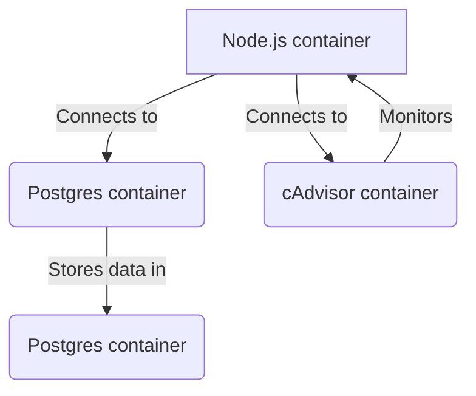

# ecoCode-rule-validator-js-cadvisor

JS Rules validator using cadvisor

## Install prerequisites

You can run the code in a [VSCODE devcontainer](https://code.visualstudio.com/docs/devcontainers/containers), which will launch the [PostGres](https://www.postgresql.org/) database and the metrics service [cAdvisor](https://github.com/google/cadvisor)

You need to have [Docker](https://www.docker.com/), [Node](https://nodejs.org/en/), [VSCode](https://code.visualstudio.com/), and the [Dev Container extension](https://marketplace.visualstudio.com/items?itemName=ms-vscode-remote.remote-containers) installed on your machine.

## Context

The tests run in a docker container.
The database is running in another container on the docker network.
The monitoring is realized through another container running cAdvisor

Running containers:

- the Node.js container with the test script, and uses pg as a driver to connect to the database,
- the Postgres container with the database,
- the cAdvisor container to monitor the execution and get the relevant data.

Write a mermaid diagram to represent the architecture of the system.

### Tools

- [Node.js](https://nodejs.org/en)
- [Docker](https://www.docker.com/)
- [Postgres](https://www.postgresql.org/)
- [cAdvisor](https://github.com/google/cadvisor)

## Structure

### .devcontainer

The code is run in a devcontainer for VSCode. If you do not use VSCode and want to run the code in another container, you need to:

1. Create a Dockerfile to build your project and run it in a Node container.
2. Use the Dockerfile in the `docker-compose.yml` file instead of the devcontainer's image.

There is a tutorial available here that you can read and adapt to your needs: [Use containers for Node.js development](https://docs.docker.com/language/nodejs/develop/)

### db/db.js

The default export is the driver that connects to the the database. Just use `db.query()` to run a SQL query.

### monitoring

#### monitoring.api.js

This contains the code to connect to the cAdvisor API using `node-fetch`.

- `setStartDate`:  You need to set a start time BEFORE the test
- `getMonitoringData`: get the raw statistic events from cAdvisor AFTER the test

#### stat.js

Using stats you can:

- `getStats`: pass the raw events you got from `getMonitoringData` to get usable statistics
- `diffStats`: pass two statistic objects to get the difference between the two. Useful to compare test scenarii
- `displayStats`: pass the statistic object to log it in the console

### src

This is where you should put the files for your test.

### utils

- `delay`: pass a number in milliseconds to wait in the process

## Usage

You can edit the postgres user in the `.dockercontainer/.env` file.

You should do the following steps for your test:

1. Write the code you need in `src`
    a. Do not forget to set a time with `setStartDate` before the test.
    b. Run the test.
    c. Get the monitoring data with `getMonitoringData` after the test, then get the statistics with `getStats`.
    d. Use the pino logger to log the results both in console and in file.
2. Execute the code in the root `index.js` file.
3. Run the code in the devcontainer with `npm start` to see the results.
4. Find the logs in the `logs` folder or in the console.

## Metrics

The data is fetched through the REST API of the cAdvisor container. The 1.3 API's documentation is here: [cAdvisor API](https://github.com/google/cadvisor/blob/master/docs/api.md). It is a bit limited, but you can observe what data is returned if you need more, or dig through the GO code here: [container.go](https://github.com/google/cadvisor/blob/master/info/v1/container.go) . There is also a web UI available at `http://localhost:8080` where you can see more data: [cAdvisor Web UI](https://github.com/google/cadvisor/blob/master/docs/web.md).

We measure the following data:

- CPU total usage: Amount of time for which the CPU was used for processing instructions in nanoseconds.
- CPU user usage: Same as befor but in the user space.
- Memory usage: Memory usage of the container in bytes.
- Network RX: Measure the amount of network traffic received by the container in bytes.
- Network TX: Measure the amount of network traffic transmitted by the container in bytes.
